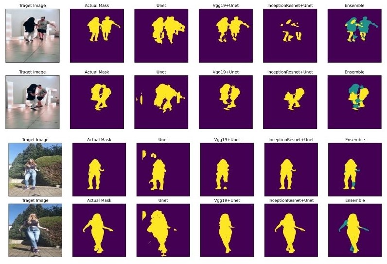
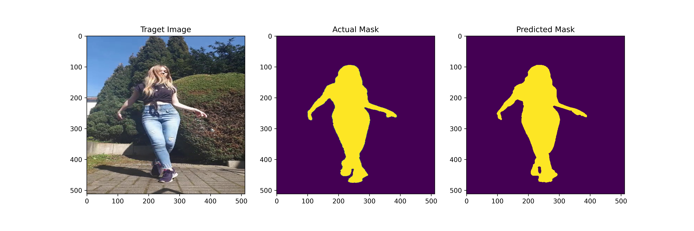
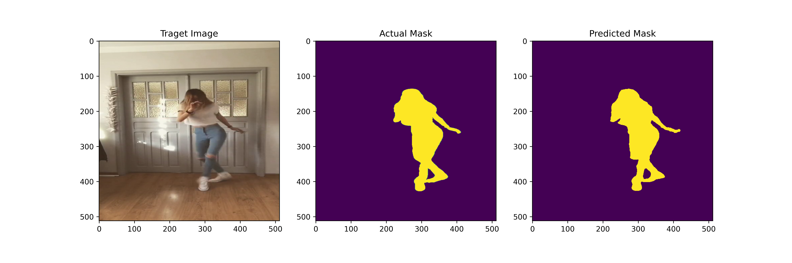
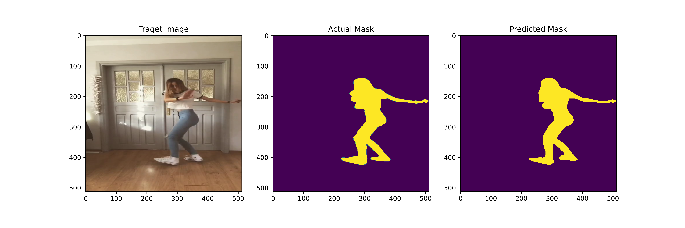
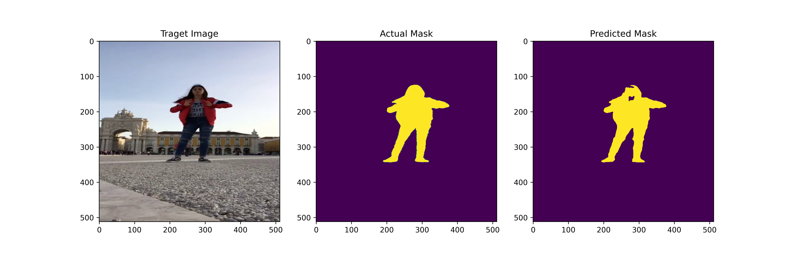
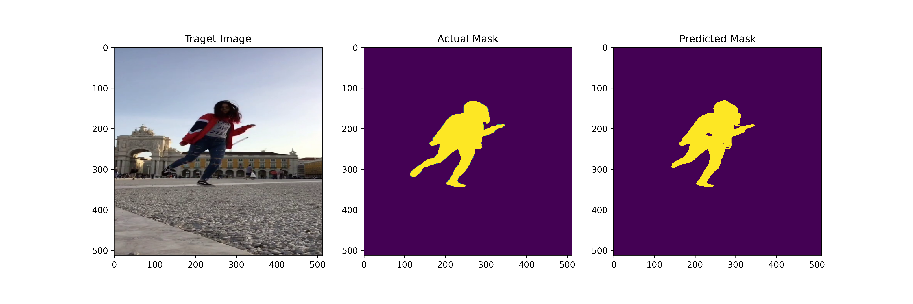
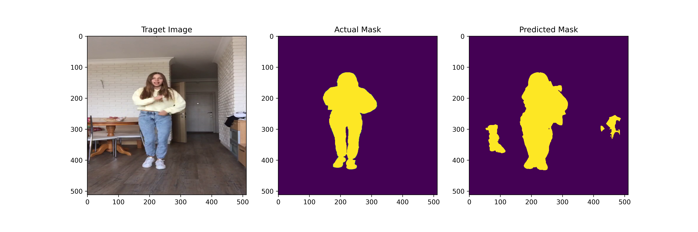
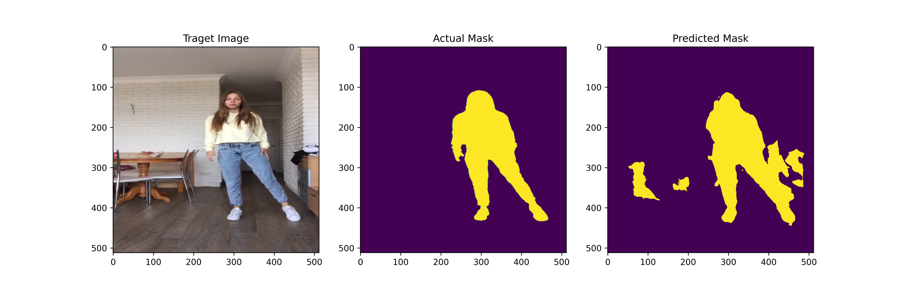
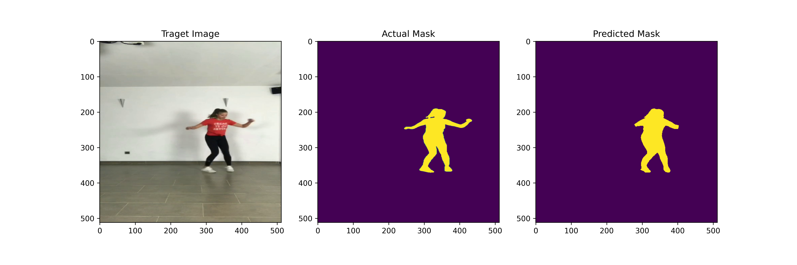

# Human Foreground-background Segmentation

## Results :- 
> Ensemble (VGG19, InceptionResnetV2) -> Unet

| DiceCoef   | IOU    | Recall   | Precision   |
|:----------:|:------:|:--------:|:-----------:|
| 0.93      | 0.87  | 0.90    | 0.92       |

> InceptionResnetV2 -> Unet

| DiceCoef   | IOU    | Recall   | Precision   |
|:----------:|:------:|:--------:|:-----------:|
| 0.89      | 0.82  | 0.87    | 0.89       |

> VGG19 -> Unet

| DiceCoef   | IOU    | Recall   | Precision   |
|:----------:|:------:|:--------:|:-----------:|
| 0.87       | 0.78   | 0.81    | 0.84       |

> Unet

| DiceCoef   | IOU    | Recall   | Precision   |
|:----------:|:------:|:--------:|:-----------:|
| 0.72      | 0.57   | 0.81    | 0.64        |

## Future Improvement
Data Augmentation would have made the model more robust and generalized well

